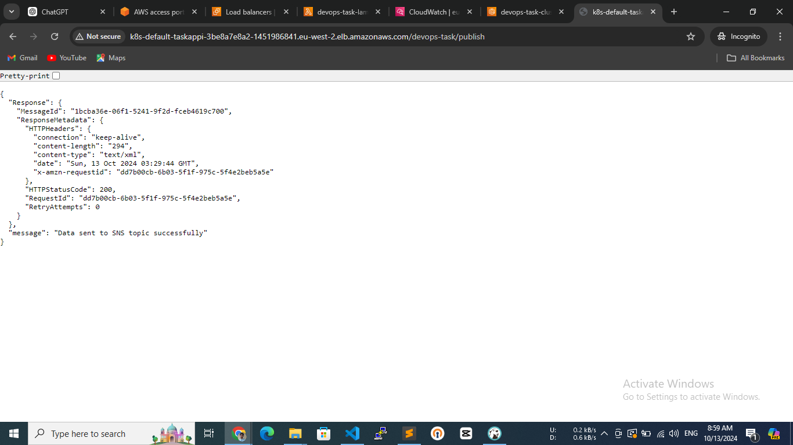
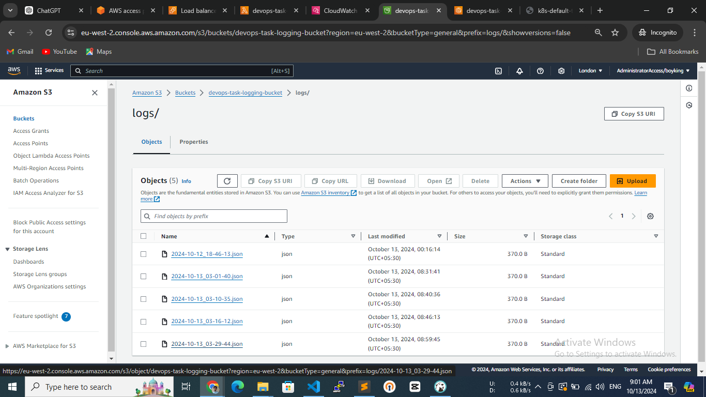
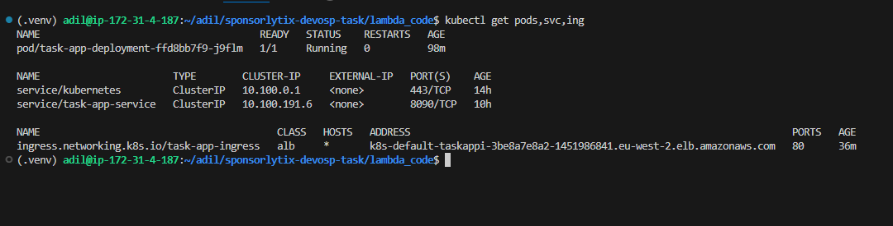

# Building CI/CD Pipeline using ArgoCD on AWS EKS

## Part 1

### Create an S3 Bucket

- Created S3 bucket with name "devops-task-logging-bucket".

### Create an Event-Driven Architecture

#### Conifugre SNS and SQS

- Created a standard SNS topic with name "devops-task-sns"
- Created a standard SQS with name "devops-task-sqs" and default settings and subscribed to SNS topic created above.

#### Create AWS Lambda Function and Postgres DB

- Created a lamdba function with "devops-task-lambda" name and python 3.10 Runtime, and x86_64 Architecture.
- Added previously created SQS as lamdba function trigger.
- Added required code and additional libraries to lambda function.
- Created AWS RDS for posgresql DB free tier DB instance.
- Created a db in postgres with "devops" name.

## Part2

- Created a python flask app and used a publically available example API (API URL - https://api.sampleapis.com/coffee/hot) to get some sample data.
- Created Dockerfile and build the docker image: `docker build -t task-app:latest .`

## Part3

### Kubernetes (EKS) Setup

#### Setup EKS

- Created EKS cluster using eksctl tool: `eksctl create cluster -f eks/eks_cluster.yaml`
- Enable OIDC: `eksctl utils associate-iam-oidc-provider --cluster devops-task-cluster --approve --region eu-west-2`
- Downloaded required policy for AWSLoadBalancerController: `curl -O https://raw.githubusercontent.com/kubernetes-sigs/aws-load-balancer-controller/v2.5.4/docs/install/iam_policy.json`
- Created Iam policy from the above json with "devops-task-cluster-AWSLoadBalancerControllerIAMPolicy" name.
- Created IAM Role / Service Account for AWS LB Controller: `eksctl create iamserviceaccount --cluster=devops-task-cluster --namespace=kube-system \
  --name=aws-load-balancer-controller \
  --role-name devops-task-cluster-AmazonEKSLoadBalancerControllerRole \
  --attach-policy-arn=arn:aws:iam::146366115606:policy/devops-task-cluster-AWSLoadBalancerControllerIAMPolicy \
  --approve`
- Attached "s3:PutObject", "s3:GetObject", "sns:Publish", and "s3:ListBucket" permissions on specific resources using IAM policy to nodegroup IAM role so that application can call sns, s3 apis.

#### Setup AWS Load Balancer Controller using helm:

```sh
helm repo add eks https://aws.github.io/eks-charts
helm repo update eks
```

```sh
helm install aws-load-balancer-controller eks/aws-load-balancer-controller -n kube-system \
  --set clusterName=devops-task-cluster \
  --set serviceAccount.create=false \
  --set serviceAccount.name=aws-load-balancer-controller \
  --set region=eu-west-2 \
  --set vpcId=vpc-02551a393f8232762
```

#### Setup ECR

- Go to AWS ECR service and create private repository there with **task-app** name.
- Now authenticate ECR and login to docker using following command: `aws ecr get-login-password --region eu-west-2 | docker login --username AWS --password-stdin 146366115606.dkr.ecr.eu-west-2.amazonaws.com`
- now build and push the docker image to ECR:

```sh
docker build -t task-app:latest .
docker tag task-app:latest 146366115606.dkr.ecr.eu-west-2.amazonaws.com/task-app:latest
docker push 146366115606.dkr.ecr.eu-west-2.amazonaws.com/task-app:latest
```

### Deploy Application
- Created k8s manifests files and stored in **k8s-manifests** directory.
- Applied manifests files using `kubectl apply -f k8s-manifests/`
- Application is running and responding successfully: 





